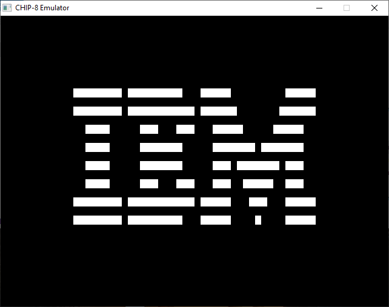

# CHIP-8 Emulator

This is a emulator running at  60fps for the interpreted programming language developed by Joseph Weisbecker in the 1970s. It's written in C++ using the Win32 API and no third party tools.

Further information about CHIP-8, the memory, registers etc. and an opcode table can you find here https://en.wikipedia.org/wiki/CHIP-8.

## Screenshot



## Requirements

You need [Visual Studio](https://visualstudio.microsoft.com/de/downloads/) If you don't want to use the IDE you can just download the Buildtools for Visual Studio. Justs scroll down on the website and look for Tools for Visual Studio.

## Compile the Source Code

Save the project and open it in Visual Studio or compile it on the command line:
!!! You need to use the Native Tools Command Prompt for VS not the standard CMD !!!

```
$ cl main.cpp /link user32.lib gdi32.lib shell32.lib 
```

You can add other compiler flags if you want to.

## Running a game

To run a game you can drag and drop it onto the .exe in Windows or you can call it from the command line with 

```
$ chip8.exe /pathToRom
```

## License

This project is licensed under the MIT. The file LICENSE includes the full license text.